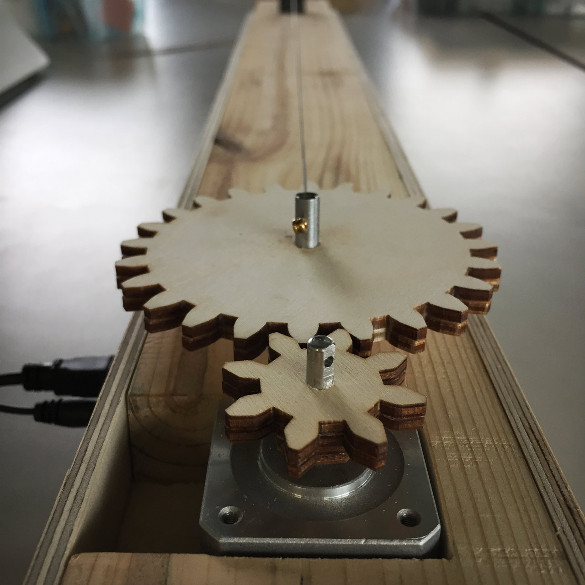

# Kinetic Cabinet - Protoype (KC-P1)

Sources for the Kinetic Cabinet protoype.

See the [related posts in my academic blog](https://academia.jansensan.net/category/imca-400/).

## Abstract

For this artwork, I will be repurposing some of the mechanical components of a guitar—strings, tuning keys, bridges—into a non-musically oriented object. Taking cues from the visual language of the grandfather clock and the grand piano, the final piece will be a windowed cabinet which will house an array of guitar strings that motors will tighten or loosen, to the point of sometimes breaking them.

I have been [playing guitar for over 20 years](https://matjb.bandcamp.com/), and I have always preferred to avoid lyrics, so that the audience of my pieces can experience emotions freely, without the bias of written and spoken language. By deconstructing the instrument that has allowed me to express myself, and reorganizing its components into a visual device, I will push my practice of post-rock—in which rock instruments are used to create non-rock music—to the point where rock instruments are used to create non-music, e.g. visual arts.

## Known Issues

At this time, it is necessary to use the [Leap Motion](https://www.leapmotion.com/) or the keyboard to trigger the motor rotation.

Ideally, the prototype would use the [ZX Distance and Gesture sensor](https://www.sparkfun.com/products/13162), just like the [Sound Pez v2](https://github.com/jansensan/sound-pez-2). However, there is not enough time before the presentation of the prototype to fix the issue of Processing being unable to handle Serial communication between two Arduino boards.